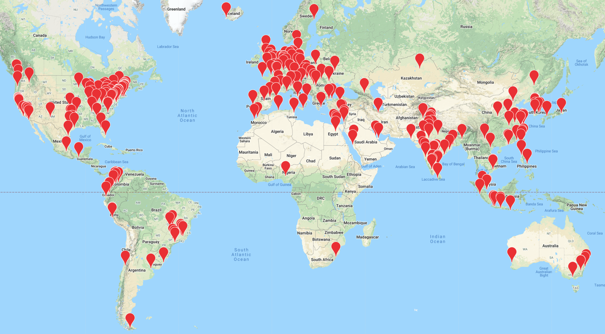

# Installing `d2l` Enviroment

The `d2l` environment contains required libraries for running all the D2L notebooks.

To check whether the `d2l` kernel exists, you can open the terminal and enter the command `$ conda-env list`.
If you don't see the `d2l` environment in your existing kernels in the above list, 
you can change directory with the command: 

`$ cd /home/studio-lab-user/d2l-pytorch-sagemaker-studio-lab`

and create a new environment using:

`$ conda env create --name d2l --file environment.yml` 

# Running with CPU or GPU Instances

You may use CPU instances to run most notebooks in the first six chapters. Running other computationally heavy notebooks can be more efficient on GPU instances.

You can switch between CPU and GPU instances by clicking `Stop instance` and restarting a new instance. Your (edited) notebooks from the old instance will be saved and relaunched with the new instance.

# About This Book

[Dive into Deep Learning (D2L)](https://www.d2l.ai/) is an open-source, interactive book that teaches the ideas, the mathematical theory, and the code that powers deep learning. It provides a comprehensive overview of deep learning principles and a state-of-the-art introduction to deep learning in computer vision and natural language processing.  

D2L has been adopted for teaching by 300 universities from 55 countries, including:

## Prerequisites

This book is for students (undergraduate or graduate),
engineers, and researchers, who seek a solid grasp
of the practical techniques of deep learning.
Because we explain every concept from scratch,
no previous background in deep learning or machine learning is required.
Fully explaining the methods of deep learning
requires some mathematics and programming,
but we will only assume that you come in with some basics,
including modest amounts of linear algebra, 
calculus, probability, and Python programming.
Just in case you forget the basics,
the Appendix chapter *Mathematics for Deep Learning*
provides a refresher 
on most of the mathematics 
you will find in this book.
Most of the time, we will prioritize 
intuition and ideas
over mathematical rigor.

## Content and Structure

This book can be roughly divided into three parts 
(corresponding to three different colors):
preliminaries, deep learning techniques,
and advanced topics with real world applications (as shown in the figure below).

  

* The first part (chapter 1-4) covers basics and preliminaries.
Chapter *1. Introduction* offers 
an overview of deep learning.
Next, Chapter *2. Preliminaries* 
teaches the prerequisites required
for hands-on deep learning, 
such as how to store and manipulate data,
and how to apply various numerical operations 
based on basic concepts from linear algebra, 
calculus, and probability.
Then, Chapter *3. Linear Neural Networks* and 
Chapter *4. Multilayer Perceptrons* 
cover the most basic concepts 
and techniques in deep learning,
including regression and classification;
linear models and multilayer perceptrons;
and overfitting and regularization.

* The next six chapters focus on modern deep learning techniques.
Chapter *5. Deep Learning Computation* describes 
the key computational components 
of deep learning systems
and lays the groundwork
for our subsequent implementations
of more complex models.
Next, Chapter *6. Convolutional Neural Networks* and 
Chapter *7. Modern Convolutional Neural Networks* 
demonstrate convolutional neural networks (CNNs), 
powerful tools that form the backbone 
of most modern computer vision (CV) systems.
Similarly, Chapter *8. Recurrent Neural Networks*  and 
Chapter *9. Modern Recurrent Neural Networks* 
illustrate recurrent neural networks (RNNs), 
models that exploit sequential (e.g., temporal) 
structure in data and are commonly used
for natural language processing (NLP) 
and time series prediction.
In Chapter *10. Attention Mechanisms*, 
we introduce a relatively new class of models
based on attention and transformer mechanisms, 
which is the dominant architecture
for most NLP tasks.
These chapters will bring you up to speed 
on the most powerful and general tools
that are widely used by deep learning practitioners.

* Part three discusses scalability, efficiency, and applications.
First, in Chapter *11. Optimization Algorithms*,
we discuss common optimization methods
used to train deep learning models.
The next Chapter *12. Computational Performance* 
examines several key factors
that influence the computational performance 
of your deep learning code.
In Chapter *13. Computer Vision*,
we illustrate major applications 
of deep learning in CV.
In Chapter *14. Natural Language Processing: Pretraining* 
and Chapter *15. Natural Language Processing: Applications*,
we show how to pretrain language representation models 
and apply them to NLP tasks.

# Table of contents

## Front Matter

* [Preface](chapter_preface/index.ipynb)
* [Installation](chapter_installation/index.ipynb)
* [Notation](chapter_notation/index.ipynb)

## Part 1: Basics and Preliminaries

* **Chapter 1:** [Introduction](chapter_introduction/index.ipynb)

* **Chapter 2:** [Preliminaries](chapter_preliminaries/index.ipynb)
    * [Data Manipulation](chapter_preliminaries/ndarray.ipynb)
    * [Data Preprocessing](chapter_preliminaries/pandas.ipynb)
    * [Linear Algebra](chapter_preliminaries/linear-algebra.ipynb)
    * [Calculus](chapter_preliminaries/calculus.ipynb)
    * [Automatic Differentiation](chapter_preliminaries/autograd.ipynb)
    * [Probability](chapter_preliminaries/probability.ipynb)
    * [Documentation](chapter_preliminaries/lookup-api.ipynb)

* **Chapter 3:** [Linear Neural Networks](chapter_linear-networks/index.ipynb)
    * [Linear Regression](chapter_linear-networks/linear-regression.ipynb)
    * [Linear Regression Implementation from Scratch](chapter_linear-networks/linear-regression-scratch.ipynb)
    * [Concise Implementation of Linear Regression](chapter_linear-networks/linear-regression-concise.ipynb)
    * [Softmax Regression](chapter_linear-networks/softmax-regression.ipynb)
    * [The Image Classification Dataset](chapter_linear-networks/image-classification-dataset.ipynb)
    * [Implementation of Softmax Regression from Scratch](chapter_linear-networks/softmax-regression-scratch.ipynb)
    * [Concise Implementation of Softmax Regression](chapter_linear-networks/softmax-regression-concise.ipynb)

* **Chapter 4:** [Multilayer Perceptrons](chapter_multilayer-perceptrons/index.ipynb)
    * [Multilayer Perceptrons](chapter_multilayer-perceptrons/mlp.ipynb)
    * [Implementation of Multilayer Perceptrons from Scratch](chapter_multilayer-perceptrons/mlp-scratch.ipynb)
    * [Concise Implementation of Multilayer Perceptrons](chapter_multilayer-perceptrons/mlp-concise.ipynb)
    * [Model Selection, Underfitting, and Overfitting](chapter_multilayer-perceptrons/underfit-overfit.ipynb)
    * [Weight Decay](chapter_multilayer-perceptrons/weight-decay.ipynb)
    * [Dropout](chapter_multilayer-perceptrons/dropout.ipynb)
    * [Forward Propagation, Backward Propagation, and Computational Graphs](chapter_multilayer-perceptrons/backprop.ipynb)
    * [Numerical Stability and Initialization](chapter_multilayer-perceptrons/numerical-stability-and-init.ipynb)
    * [Environment and Distribution Shift](chapter_multilayer-perceptrons/environment.ipynb)
    * [Predicting House Prices on Kaggle](chapter_multilayer-perceptrons/kaggle-house-price.ipynb)

## Part 2: Modern Deep Learning Techniques

* **Chapter 5:** [Deep Learning Computation](chapter_deep-learning-computation/index.ipynb)
    * [Layers and Blocks](chapter_deep-learning-computation/model-construction.ipynb)
    * [Parameter Management](chapter_deep-learning-computation/parameters.ipynb)
    * [Custom Layers](chapter_deep-learning-computation/custom-layer.ipynb)
    * [File I/O](chapter_deep-learning-computation/read-write.ipynb)
    * [GPUs](chapter_deep-learning-computation/use-gpu.ipynb)

* **Chapter 6:** [Convolutional Neural Networks](chapter_convolutional-neural-networks/index.ipynb)
    * [From Fully-Connected Layers to Convolutions](chapter_convolutional-neural-networks/why-conv.ipynb)
    * [Convolutions for Images](chapter_convolutional-neural-networks/conv-layer.ipynb)
    * [Padding and Stride](chapter_convolutional-neural-networks/padding-and-strides.ipynb)
    * [Multiple Input and Multiple Output Channels](chapter_convolutional-neural-networks/channels.ipynb)
    * [Pooling](chapter_convolutional-neural-networks/pooling.ipynb)
    * [Convolutional Neural Networks (LeNet)](chapter_convolutional-neural-networks/lenet.ipynb)

* **Chapter 7:** [Modern Convolutional Neural Networks](chapter_convolutional-modern/index.ipynb)
    * [Deep Convolutional Neural Networks (AlexNet)](chapter_convolutional-modern/alexnet.ipynb)
    * [Networks Using Blocks (VGG)](chapter_convolutional-modern/vgg.ipynb)
    * [Network in Network (NiN)](chapter_convolutional-modern/nin.ipynb)
    * [Networks with Parallel Concatenations (GoogLeNet)](chapter_convolutional-modern/googlenet.ipynb)
    * [Batch Normalization](chapter_convolutional-modern/batch-norm.ipynb)
    * [Residual Networks (ResNet)](chapter_convolutional-modern/resnet.ipynb)
    * [Densely Connected Networks (DenseNet)](chapter_convolutional-modern/densenet.ipynb)

* **Chapter 8:** [Recurrent Neural Networks](chapter_recurrent-neural-networks/index.ipynb)
    * [Sequence Models](chapter_recurrent-neural-networks/sequence.ipynb)
    * [Text Preprocessing](chapter_recurrent-neural-networks/text-preprocessing.ipynb)
    * [Language Models and the Dataset](chapter_recurrent-neural-networks/language-models-and-dataset.ipynb)
    * [Recurrent Neural Networks](chapter_recurrent-neural-networks/rnn.ipynb)
    * [Implementation of Recurrent Neural Networks from Scratch](chapter_recurrent-neural-networks/rnn-scratch.ipynb)
    * [Concise Implementation of Recurrent Neural Networks](chapter_recurrent-neural-networks/rnn-concise.ipynb)
    * [Backpropagation Through Time](chapter_recurrent-neural-networks/bptt.ipynb)

* **Chapter 9:** [Modern Recurrent Neural Networks](chapter_recurrent-modern/index.ipynb)
    * [Gated Recurrent Units (GRU)](chapter_recurrent-modern/gru.ipynb)
    * [Long Short-Term Memory (LSTM)](chapter_recurrent-modern/lstm.ipynb)
    * [Deep Recurrent Neural Networks](chapter_recurrent-modern/deep-rnn.ipynb)
    * [Bidirectional Recurrent Neural Networks](chapter_recurrent-modern/bi-rnn.ipynb)
    * [Machine Translation and the Dataset](chapter_recurrent-modern/machine-translation-and-dataset.ipynb)
    * [Encoder-Decoder Architecture](chapter_recurrent-modern/encoder-decoder.ipynb)
    * [Sequence to Sequence Learning](chapter_recurrent-modern/seq2seq.ipynb)
    * [Beam Search](chapter_recurrent-modern/beam-search.ipynb)

* **Chapter 10:** [Attention Mechanisms](chapter_attention-mechanisms/index.ipynb)
    * [Attention Cues](chapter_attention-mechanisms/attention-cues.ipynb)
    * [Attention Pooling: Nadaraya-Watson Kernel Regression](chapter_attention-mechanisms/nadaraya-watson.ipynb)
    * [Attention Scoring Functions](chapter_attention-mechanisms/attention-scoring-functions.ipynb)
    * [Bahdanau Attention](chapter_attention-mechanisms/bahdanau-attention.ipynb)
    * [Multi-Head Attention](chapter_attention-mechanisms/multihead-attention.ipynb)
    * [Self-Attention and Positional Encoding](chapter_attention-mechanisms/self-attention-and-positional-encoding.ipynb)
    * [Transformer](chapter_attention-mechanisms/transformer.ipynb)

## Part 3: Scalability, Efficiency, and Applications

* **Chapter 11:** [Optimization Algorithms](chapter_optimization/index.ipynb)
    * [Optimization and Deep Learning](chapter_optimization/optimization-intro.ipynb)
    * [Convexity](chapter_optimization/convexity.ipynb)
    * [Gradient Descent](chapter_optimization/gd.ipynb)
    * [Stochastic Gradient Descent](chapter_optimization/sgd.ipynb)
    * [Minibatch Stochastic Gradient Descent](chapter_optimization/minibatch-sgd.ipynb)
    * [Momentum](chapter_optimization/momentum.ipynb)
    * [Adagrad](chapter_optimization/adagrad.ipynb)
    * [RMSProp](chapter_optimization/rmsprop.ipynb)
    * [Adadelta](chapter_optimization/adadelta.ipynb)
    * [Adam](chapter_optimization/adam.ipynb)
    * [Learning Rate Scheduling](chapter_optimization/lr-scheduler.ipynb)

* **Chapter 12:** [Computational Performance](chapter_computational-performance/index.ipynb)
    * [Compilers and Interpreters](chapter_computational-performance/hybridize.ipynb)
    * [Asynchronous Computation](chapter_computational-performance/async-computation.ipynb)
    * [Automatic Parallelism](chapter_computational-performance/auto-parallelism.ipynb)
    * [Hardware](chapter_computational-performance/hardware.ipynb)
    * [Training on Multiple GPUs](chapter_computational-performance/multiple-gpus.ipynb)
    * [Concise Implementation for Multiple GPUs](chapter_computational-performance/multiple-gpus-concise.ipynb)
    * [Parameter Servers](chapter_computational-performance/parameterserver.ipynb)

* **Chapter 13:** [Computer Vision](chapter_computer-vision/index.ipynb)
    * [Image Augmentation](chapter_computer-vision/image-augmentation.ipynb)
    * [Fine-Tuning](chapter_computer-vision/fine-tuning.ipynb)
    * [Object Detection and Bounding Boxes](chapter_computer-vision/bounding-box.ipynb)
    * [Anchor Boxes](chapter_computer-vision/anchor.ipynb)
    * [Multiscale Object Detection](chapter_computer-vision/multiscale-object-detection.ipynb)
    * [The Object Detection Dataset](chapter_computer-vision/object-detection-dataset.ipynb)
    * [Single Shot Multibox Detection](chapter_computer-vision/ssd.ipynb)
    * [Region-based CNNs (R-CNNs)](chapter_computer-vision/rcnn.ipynb)
    * [Semantic Segmentation and the Dataset](chapter_computer-vision/semantic-segmentation-and-dataset.ipynb)
    * [Transposed Convolution](chapter_computer-vision/transposed-conv.ipynb)
    * [Fully Convolutional Networks](chapter_computer-vision/fcn.ipynb)
    * [Neural Style Transfer](chapter_computer-vision/neural-style.ipynb)
    * [Image Classification (CIFAR-10) on Kaggle](chapter_computer-vision/kaggle-cifar10.ipynb)
    * [Dog Breed Identification (ImageNet Dogs) on Kaggle](chapter_computer-vision/kaggle-dog.ipynb)

* **Chapter 14:** [Natural Language Processing: Pretraining](chapter_natural-language-processing-pretraining/index.ipynb)
    * [Word Embedding (word2vec)](chapter_natural-language-processing-pretraining/word2vec.ipynb)
    * [Approximate Training](chapter_natural-language-processing-pretraining/approx-training.ipynb)
    * [The Dataset for Pretraining Word Embeddings](chapter_natural-language-processing-pretraining/word-embedding-dataset.ipynb)
    * [Pretraining word2vec](chapter_natural-language-processing-pretraining/word2vec-pretraining.ipynb)
    * [Word Embedding with Global Vectors (GloVe)](chapter_natural-language-processing-pretraining/glove.ipynb)
    * [Subword Embedding](chapter_natural-language-processing-pretraining/subword-embedding.ipynb)
    * [Word Similarity and Analogy](chapter_natural-language-processing-pretraining/similarity-analogy.ipynb)
    * [Bidirectional Encoder Representations from Transformers (BERT)](chapter_natural-language-processing-pretraining/bert.ipynb)
    * [The Dataset for Pretraining BERT](chapter_natural-language-processing-pretraining/bert-dataset.ipynb)
    * [Pretraining BERT](chapter_natural-language-processing-pretraining/bert-pretraining.ipynb)

* **Chapter 15:** [Natural Language Processing: Applications](chapter_natural-language-processing-applications/index.ipynb)
    * [Sentiment Analysis and the Dataset](chapter_natural-language-processing-applications/sentiment-analysis-and-dataset.ipynb)
    * [Sentiment Analysis: Using Recurrent Neural Networks](chapter_natural-language-processing-applications/sentiment-analysis-rnn.ipynb)
    * [Sentiment Analysis: Using Convolutional Neural Networks](chapter_natural-language-processing-applications/sentiment-analysis-cnn.ipynb)
    * [Natural Language Inference and the Dataset](chapter_natural-language-processing-applications/natural-language-inference-and-dataset.ipynb)
    * [Natural Language Inference: Using Attention](chapter_natural-language-processing-applications/natural-language-inference-attention.ipynb)
    * [Fine-Tuning BERT for Sequence-Level and Token-Level Applications](chapter_natural-language-processing-applications/finetuning-bert.ipynb)
    * [Natural Language Inference: Fine-Tuning BERT](chapter_natural-language-processing-applications/natural-language-inference-bert.ipynb)

* **Chapter 16:** [Generative Adversarial Networks](chapter_generative-adversarial-networks/index.ipynb)
    * [Generative Adversarial Networks](chapter_generative-adversarial-networks/gan.ipynb)
    * [Deep Convolutional Generative Adversarial Networks](chapter_generative-adversarial-networks/dcgan.ipynb)

## Appendix

* **Chapter Appendix:** [Mathematics for Deep Learning](chapter_appendix-mathematics-for-deep-learning/index.ipynb)
    * [Geometry and Linear Algebraic Operations](chapter_appendix-mathematics-for-deep-learning/geometry-linear-algebraic-ops.ipynb)
    * [Eigendecompositions](chapter_appendix-mathematics-for-deep-learning/eigendecomposition.ipynb)
    * [Single Variable Calculus](chapter_appendix-mathematics-for-deep-learning/single-variable-calculus.ipynb)
    * [Multivariable Calculus](chapter_appendix-mathematics-for-deep-learning/multivariable-calculus.ipynb)
    * [Integral Calculus](chapter_appendix-mathematics-for-deep-learning/integral-calculus.ipynb)
    * [Random Variables](chapter_appendix-mathematics-for-deep-learning/random-variables.ipynb)
    * [Maximum Likelihood](chapter_appendix-mathematics-for-deep-learning/maximum-likelihood.ipynb)
    * [Distributions](chapter_appendix-mathematics-for-deep-learning/distributions.ipynb)
    * [Naive Bayes](chapter_appendix-mathematics-for-deep-learning/naive-bayes.ipynb)
    * [Statistics](chapter_appendix-mathematics-for-deep-learning/statistics.ipynb)
    * [Information Theory](chapter_appendix-mathematics-for-deep-learning/information-theory.ipynb)

* **Chapter Appendix:** [Tools for Deep Learning](chapter_appendix-tools-for-deep-learning/index.ipynb)
    * [Using Amazon SageMaker](chapter_appendix-tools-for-deep-learning/sagemaker.ipynb)
    * [Selecting Servers and GPUs](chapter_appendix-tools-for-deep-learning/selecting-servers-gpus.ipynb)
    * [Contributing to This Book](chapter_appendix-tools-for-deep-learning/contributing.ipynb)
